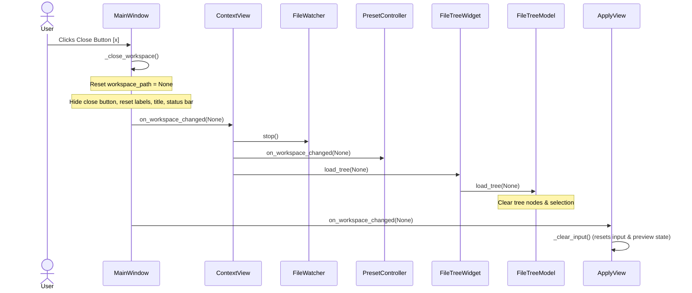

# Design Spec: Close Workspace Feature

Feature to reset the application state to "no project open" dynamically when requested by the user.

## Goals

Provide a clean way for the user to close their currently opened project/workspace without restarting the application, ensuring that no file watch logs, token count background tasks, or stale file systems remain active.

## Proposed UI Changes

### Top Bar (`presentation/main_window.py`)
- Add a `self._close_workspace_btn` (QToolButton) right next to the current workspace path label.
- Set its icon to `x.svg` colored with `ThemeColors.TEXT_SECONDARY`.
- Keep it hidden by default (`setVisible(False)`).
- Make it visible when a workspace is loaded, either via the folder dialog, from recent history, or on startup via session restore.
- Action: Connects to `self._close_workspace` Slot.

## Architecture and Data Flow



## Proposed Changes

### `presentation/main_window.py`

- Modify `_build_top_bar` to insert the QToolButton `self._close_workspace_btn` next to the folder path label.
- Implement `@Slot() def _close_workspace(self)`:
  - Reset `self.workspace_path = None`, `self._cached_git_branch = None`, and `self._git_branch_pending = False`.
  - Set `self._close_workspace_btn.setVisible(False)`.
  - Update `self._folder_path_label` to `"No folder selected"`.
  - Update window title and status bar via `_update_window_title()` and `_update_status_bar()`.
  - Call `self.context_view.on_workspace_changed(None)`.
  - Call `self.apply_view.on_workspace_changed(None)`.
- Update `_set_workspace` and `_restore_session` to call `self._close_workspace_btn.setVisible(True)` when workspace path is loaded.

### `presentation/views/context/context_view_qt.py`

- Modify `on_workspace_changed(self, workspace_path: Optional[Path])`:
  - Allow `workspace_path` to be `None`.
  - Guard the file watcher start step to only run if `workspace_path` is not `None`.
  - Guard tree loading: if `workspace_path` is `None`, load `None` in the tree.

### `presentation/views/context/preset_controller.py`

- Modify `on_workspace_changed(self, workspace_path: Optional[Path])`:
  - If `workspace_path` is `None`, set `self._store = None`.

### `presentation/components/file_tree/file_tree_widget.py`

- Modify `load_tree(self, workspace_path: Optional[Path])`:
  - Allow `workspace_path` to be `None`.
  - If `None`, stop `_selection_poll_timer`.

### `presentation/components/file_tree/file_tree_model.py`

- Modify `load_tree(self, workspace_path: Optional[Path])`:
  - Allow `workspace_path` to be `None`.
  - Guard shallow scanner calls.
  - Reset model with `beginResetModel`/`endResetModel` and clear search indexes.

### `presentation/views/apply/apply_view_qt.py`

- Implement `on_workspace_changed(self, workspace_path: Optional[Path])`:
  - Update the workspace label (`self._workspace_label`) to the workspace name or `"No workspace"`.
  - Call `self._clear_input()` to clear all OPX input and parsed results.

## Verification Plan

### Automated Tests
- Run unit tests and E2E tests:
  ```bash
  pytest tests/ -v
  ```
- Write a new test in `tests/test_e2e_critical_flows.py` or another suitable place to verify that calling the close workspace slot correctly resets the workspace path and clears the tree.

### Manual Verification
- Launch the application using `./start.sh` or `python main_window.py`.
- Open a workspace. Verify that the `[x]` close button appears.
- Click the close button. Verify that the window title becomes "Synapse Desktop — No project open", the file tree is cleared, the workspace path label shows "No folder selected", the status bar shows "No workspace", and the Apply view input is cleared.
